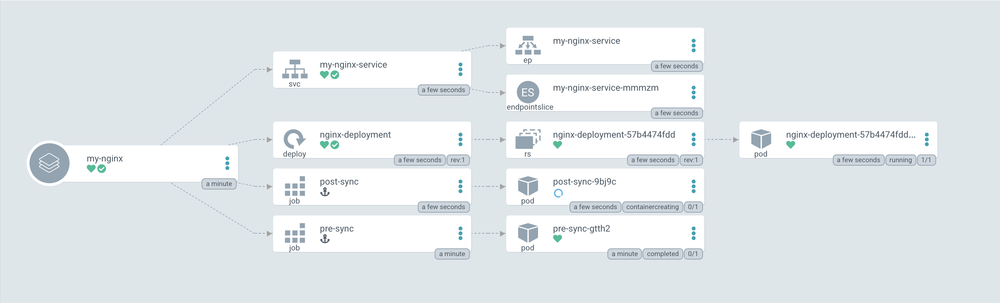
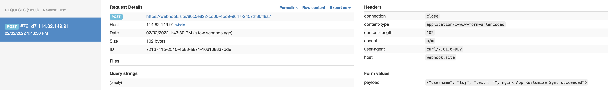

# k8s_demo_yaml

A control repo for k8s related resources, pod, deployment, service, ingress, hpa, pc, pvc, etc...There is also some resources for helm, kustomize and argocd related things. In the `.github` directory, I integrated all these things with GitHub Action workflow to demonstrate a full automation process for CI/CD.

## k8s resource yaml

In the `k8s_resource_yaml` directory of this repo, I expose some k8s built-in CRD resource yaml files, like `pod.yaml`, `deployment.yaml`, `ingress.yaml`, `hpa.yaml` and some useful `kubectl` command in `command.txt` file.

You can just run `kubectl apply -f $CRD.yaml` to deploy these CRD, I have made a cutomized nginx image according to `Dockerfile` and uploaded to [my docker hub repo](https://hub.docker.com/repository/docker/dhutsj/nginx/general). For the ingress, canary release and gray release, you need to install nginx ingress controller.

### My nginx Helm Chart

In the `my-nginx` directory, I made a helm chart for my customized nginx service which contains one deployment and one service. If you need ingress, you can reference the `nginx-ingress.yaml` in the `nginx-demo` directory.

You can use `helm install my-nginx my-nginx-0.1.0.tgz` to install it. If you need to customize it, you can overwrite the `values.yaml` file and run `helm install my-nginx my-nginx-0.1.0.tgz -f my-values.yaml`.

Helm installation is one of the way ArgoCD support to sync app. So try this folder in ArgoCD.

### Kustomize

In the `nginx-kustomize-demo` directory, I used kustomized to deploy my nginx. You can go to `overlays/prod` or `overlays/staging` folder. Run command `kustomize build ./{prod|staging}/ | kubectl apply -f -` to apply it. In the `staging` folder, I used [ArgoCD resource hook](https://argo-cd.readthedocs.io/en/stable/user-guide/resource_hooks/) `pre-sync` and `post-sync`.

Kustomize deployment is the recommended way to sync app in ArgoCD. So try this folder in ArgoCD. You should see the below diagram.

You will get the message triggered by the `post-sync` hook.

